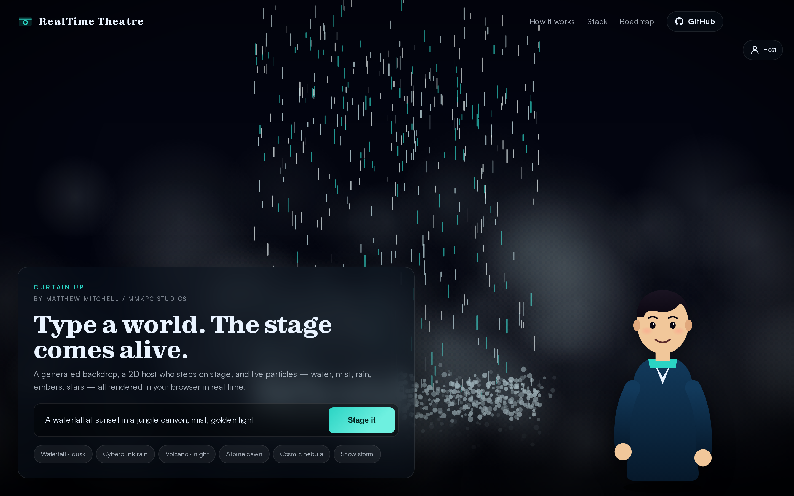

<p align="center">
  
  
  
</p>

# RealTime Theatre

**Type a world. The stage comes alive.**
A generated backdrop, a 2D host who steps on stage, and live procedural particles — water,
mist, rain, embers, stars, parallax — all rendered in your browser in real time.

### 🔗 [**Live site → realtime-theatre.vercel.app**](https://realtime-theatre.vercel.app)



<sub>Curtain-up hero · prompt bar, 2D host, procedural VFX canvas</sub>

> Not a 3D asset generator. A living stage. That's the product wedge.

---

## Problem

Most "prompt → visual" products stop at a flat image. Full 3D asset generators (Hunyuan3D-2,
TRELLIS) solve a different problem — you get a mesh, not a moment. There's an un-occupied
middle: **real-time entertainment**, where a single prompt produces an atmosphere that
breathes — a stage you can present, talk over, or stream.

The sweet spot is **text-to-image + image-structure + procedural VFX**, not full 3D. You get
a richer result than a still, without the cost, latency, and fragility of 3D generation.

## Solution

A 2.5D theatre pipeline:

1. **Prompt** — user types a world.
2. **Backdrop** — a FLUX-class text-to-image model generates the base plate.
3. **Scene read** — structure / depth / scene tagging turns the plate into parallax layers,
   particle masks, a palette, and a mood.
4. **Live stage** — a browser renderer drives scene-matched particles, flow, mist, fog, fire,
   stars, and parallax.
5. **Host** — a 2D avatar steps on stage, breathing, blinking, gesturing, and reacting
   to each scene.

## Architecture

```
 ┌────────┐   HTTPS   ┌─────────────────┐   REST   ┌──────────────────────┐
 │ Client │──────────▶│ FastAPI backend │─────────▶│ Text-to-image worker │
 │ (web)  │           │  /api/scene     │          │   FLUX.1-dev · SDXL  │
 └───┬────┘           │                 │          └──────────┬───────────┘
     │                │  prompt →       │                     │
     │                │  classify →     │          ┌──────────▼───────────┐
     │◀───────────────│  enrich →       │          │ Depth / scene read   │
     │   base plate   │  depth (opt.)   │◀─────────│   Depth-Anything-V2  │
     │   + scene JSON │                 │          └──────────────────────┘
     │                └─────────────────┘
     │
     ▼
 ┌──────────────────────────────────────────────────────────┐
 │           Browser stage (runs in your tab)               │
 │                                                          │
 │  ┌──────────┐  ┌──────────┐  ┌──────────┐  ┌──────────┐  │
 │  │ Backdrop │  │  Canvas  │  │   Host   │  │  Colour  │  │
 │  │     │  │ particles│  │  2D SVG  │  │  grade   │  │
 │  │ parallax │  │ water •  │  │ breathe  │  │ palette- │  │
 │  │          │  │ mist •   │  │ blink •  │  │ driven   │  │
 │  │          │  │ rain •   │  │ wave •   │  │ blend    │  │
 │  │          │  │ embers • │  │ speech   │  │ layer    │  │
 │  │          │  │ stars    │  │ bubble   │  │          │  │
 │  └──────────┘  └──────────┘  └──────────┘  └──────────┘  │
 │         └──────── parallax from pointer ────────┘        │
 └──────────────────────────────────────────────────────────┘
```

## What's in this repo

```
realtime-theatre/
├── backend/
│   ├── api_server.py        FastAPI: /api/scene endpoint, prompt classifier
│   └── generate_image.py    Swap-in point for FLUX.1-dev / SDXL
├── frontend/
│   ├── index.html           Stage markup + inline SVG host + HUD
│   ├── styles.css           Design tokens, HUD, host avatar, sections
│   └── app.js               VFX renderer, host animation, scene orchestration
├── docs/
│   └── ARCHITECTURE.md      Detailed layer notes + upgrade path
├── LICENSE                  MIT
└── README.md                (this file)
```

## Running locally

```bash
# 1) Backend (scene classifier + image proxy)
cd backend
python -m venv .venv && source .venv/bin/activate
pip install -r requirements.txt
# Plug in your image provider inside generate_image.py, then:
python api_server.py   # serves on :8000

# 2) Frontend (any static server works)
cd ../frontend
python -m http.server 5173
# open http://localhost:5173
```

The frontend auto-targets `http://localhost:8000` when run locally. When deployed, set
`window.__API__` or edit the `API` constant at the top of `app.js` to point at your
hosted backend.

## The layers (real stack)

| Layer | Repo | Model |
| ----- | ---- | ----- |
| Text-to-image | [black-forest-labs/flux](https://github.com/black-forest-labs/flux) | [FLUX.1-dev](https://huggingface.co/black-forest-labs/FLUX.1-dev), [FLUX.1-schnell](https://huggingface.co/black-forest-labs/FLUX.1-schnell) |
| Pipeline library | [huggingface/diffusers](https://github.com/huggingface/diffusers) | n/a |
| Workflow UI | [Comfy-Org/ComfyUI](https://github.com/Comfy-Org/ComfyUI) · [ComfyUI-Manager](https://github.com/Comfy-Org/ComfyUI-Manager) | n/a |
| Depth / structure | [DepthAnything/Depth-Anything-V2](https://github.com/DepthAnything/Depth-Anything-V2) | [Depth-Anything-V2-Large](https://huggingface.co/depth-anything/Depth-Anything-V2-Large) |
| Structural conditioning | — | [FLUX.1-Depth-dev](https://huggingface.co/black-forest-labs/FLUX.1-Depth-dev), [FLUX.1-Canny-dev](https://huggingface.co/black-forest-labs/FLUX.1-Canny-dev) |
| Style fine-tuning | [adobe-research/custom-diffusion](https://github.com/adobe-research/custom-diffusion) | — |
| Image / text → video | [zai-org/CogVideo](https://github.com/zai-org/CogVideo) | [CogVideoX-5B](https://huggingface.co/zai-org/CogVideoX-5b) · [CogVideoX-2B](https://huggingface.co/zai-org/CogVideoX-2b) |
| Neural scenes (later) | [nerfstudio-project/gsplat](https://github.com/nerfstudio-project/gsplat) | — |
| 3D assets (later) | [Tencent-Hunyuan/Hunyuan3D-2](https://github.com/Tencent-Hunyuan/Hunyuan3D-2) · [microsoft/TRELLIS](https://github.com/microsoft/TRELLIS) | — |

## Roadmap

1. **Prompt → backdrop** — FLUX.1-dev via Diffusers. Seed control + negative prompts.
2. **Backdrop → depth / layers** — Depth-Anything-V2. RGBD + foreground / background masks
   drive particle occlusion and parallax.
3. **Browser stage** — port the canvas renderer to WebGPU (Three.js TSL) for fluid sim,
   volumetric fog, cubemap sky.
4. **Reactive host** — voice input, lipsync, scene-aware reactions, wardrobe & palette
   swaps.
5. **Motion mode** — image-to-video via CogVideoX-5B for premium 6-second clips.
6. *Later:* Gaussian splats (gsplat) or textured 3D assets (Hunyuan3D-2, TRELLIS) — only
   if the product shifts to "download a mesh."

## Honest disclosure (MVP vs. production)

The MVP in this repo uses a lightweight keyword-driven classifier where Depth-Anything-V2
belongs, and calls a FLUX-class image model via a hosted provider — not FLUX.1-dev
running on open weights. `docs/ARCHITECTURE.md` spells out every difference and exactly
where to swap in real Diffusers / Depth-Anything workers. The browser renderer and host
avatar are fully real.

## Credits

Built by **Matthew Mitchell** · MMKPC Studios · <memitchell@mmkpcstudios.com>

More work: [github.com/MMKPC](https://github.com/MMKPC)

## License

[MIT](./LICENSE) — © 2026 Matthew Mitchell / MMKPC Studios. Fork freely. Credit appreciated.
